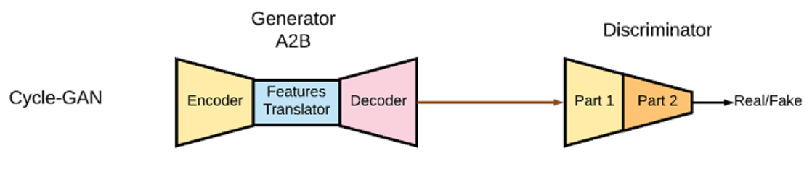

# Bidirectional-Image-to-Image-Translator

Image semantic segmentation is a common use of Image-to-Image translation and we will be focusing on that approach in this repo. Specifically, we want a GAN to both learn from semantic information and generate a high-quality image and also be given an image and produce a segmented image from it. We will be using the CycleGAN to develop out Translator.

Reference to CycleGAN paper: https://arxiv.org/pdf/1703.10593.pdf

The Cycle GAN learns the mapping G: X -> Y where X is defined as the first set of images and Y is the augmented or segmented Image form. The CycleGAN also couples the inverse mapping of G, F: Y -> X which takes the augmented or segmented image as input and generates the inital image form. In an ideal case, F(G(X)) = F(Y) = X. These two inverse mappings are represented as coupled generators with joint loss trained coined cycle-consistency loss. The forward cycle is defined by: y -> F(x) -> G(F(y)) = y while the backward cycle-consistency loss is defined as: x -> G(x) -> F(G(x)) = x; hence the name, CycleGAN. 

The CycleGAN utilizes Residual Blocks to learn feature mappings through convolutions and translates from one feature to the other. The CycleGAN generator can be split into 3 main components. The Encoder, Translator, and Decoder. The Encoder is where downsizing occurs and feature space expansion to be passed through the translator. The translator is a sequence of residual blocks learning the feature mapping described above. The Decoder upsamples the image dimensions and shrinks the feature space size back to the original channel size, in this case, RGB. The CycleGAN also utilizes Instance Normalization instead of Batch Normalization and Reflection Padding to reduce artifacts within generated data. 

## Dataset

The Dataset I used ADE20K Segmentation Dataset composed of various images paired with their segmented counterparts as well as text files containing details of the image itself. In this experiment, I split the real images and segmented images into seperate folders and loaded them as pairs which is not necessary as CycleGAN architecture is designed to handle unpaired translation. Link to dataset: https://groups.csail.mit.edu/vision/datasets/ADE20K/

### Citations: 

Scene Parsing through ADE20K Dataset. Bolei Zhou, Hang Zhao, Xavier Puig, Sanja Fidler, Adela Barriuso and Antonio Torralba. Computer Vision and Pattern Recognition (CVPR), 2017. http://people.csail.mit.edu/bzhou/publication/scene-parse-camera-ready.pdf

Semantic Understanding of Scenes through ADE20K Dataset. Bolei Zhou, Hang Zhao, Xavier Puig, Tete Xiao, Sanja Fidler, Adela Barriuso and Antonio Torralba. International Journal on Computer Vision (IJCV). https://arxiv.org/pdf/1608.05442.pdf

## Sample Images:

### Segmentation -> Image

### Image -> Segmentation

## Next Steps

As you can see from the samples, the joint Generators in the CycleGAN are able to learn the feature association fairly well however, there are still some discrepancies with how the Generator interprets the semantic information with the dataset. Similar objects within an image may have different semantic information causing the generating to assume they are different objects or materials. Also, more often than not, the semantic image cuts out a lot of information present within the original image, making it virtually impossible for the generator the mimic the original image.

### For example, take a look at the generated image from the input segmentation:

### Segmentation -> Image

### Original Image

As you can see, the box-shaped objects are meant to be screens but the specific output of the screens are omitted in the segmented image. Many details from the bottom part of the image are also omitted making it hard for Generator to predict they are screens rather than simple windows or ornaments on the wall is is the case with a lot of other examples. The CycleGAN was also trained for relatively low epochs and low sample size due to limited resouces and memory. For better performance, a more semantically organized dataset with larger sample pool would be required. More epochs trained with larger translation component also has shown to increase performance and quality of generated images.

